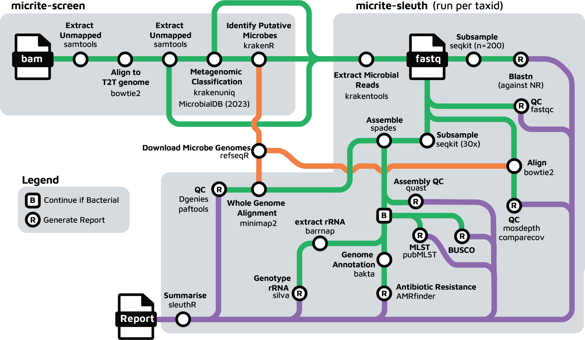

# Micrite

A nextflow workflow for detection of microbial genomes from cancer whole-genome-sequenced bams.

## Quick Start

The micrite pipeline is made up of three sub-pipelines

1. [micrite-screen](https://github.com/selkamand/micrite-screen) for rapid screening of BAMs for microbial reads.
2. [micrite-sleuth](https://github.com/selkamand/micrite-sleuth) for slower but exhaustive *in silico* validation that a specific species of interest (e.g. those flagged by micrite-screen) is indeed present and not just misclassified host-sequences.
3. [micrite-subtype](https://github.com/selkamand/micrite-subtype) for deep genotyping of common oncoviruses (*in-development*).

## Workflow

## Quick Start 

To get started with micrite we recommend running micrite-screen as described [here](https://github.com/selkamand/micrite-screen).
